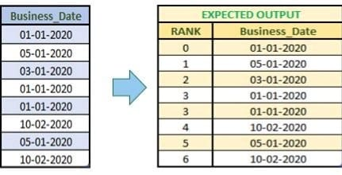
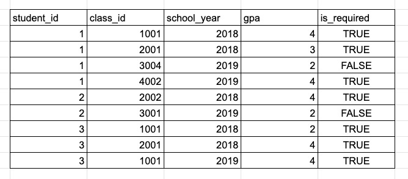
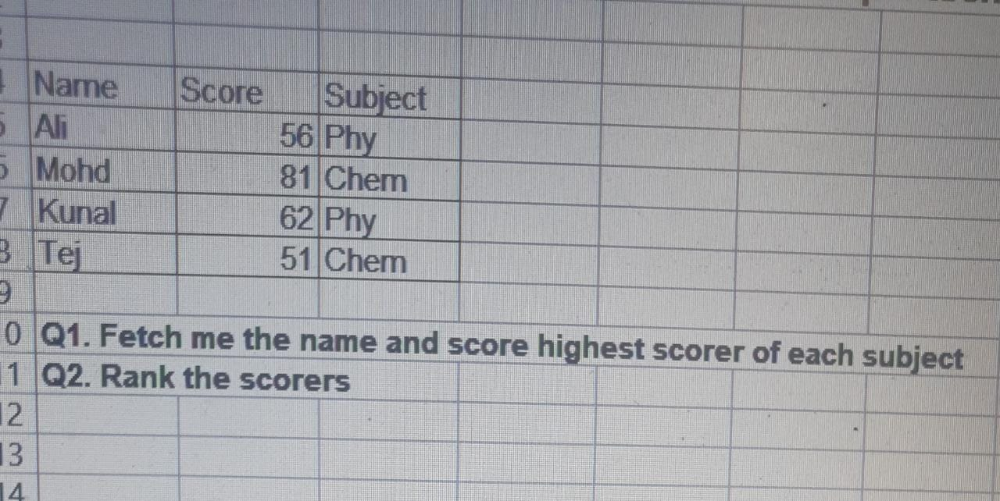
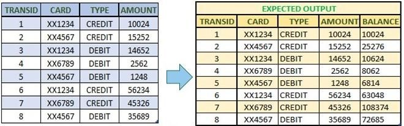
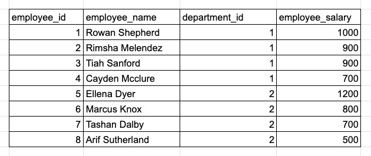

# SQL questions

## Question 1

As shown in the picture below, provide rank to each row in such manner that Rank should start with 0 (Zero) and incremented by 1 (One) whenever there's a change in the date.  
_Difficulty: Medium_

## Question 2

Calculate the average GPA required for each student and find students who are qualified for the Dean's List (GPA >= 3.5) in each semester (only applicable where is_required = True).  
_Difficulty: Easy_

[Solution](Question-2/SQL_A2.sql)

## Question 3

1. Find the name and score of the highest scorer in each subject. 
2. Rank the scorers.  
_Difficulty: Easy_

## Question 4

Create a new column which maintains the running amount considering credit/debit.

## Question 5

Find the top 3 employees who have the highest salary in each department.

